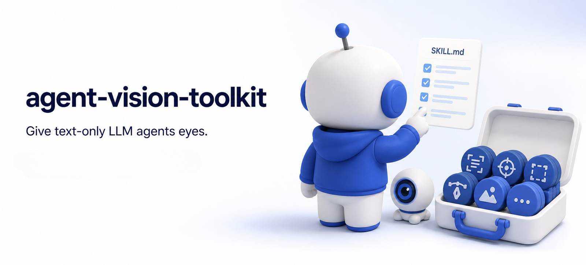
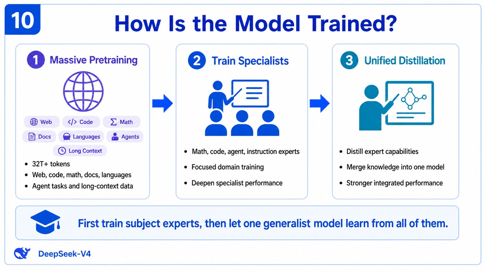
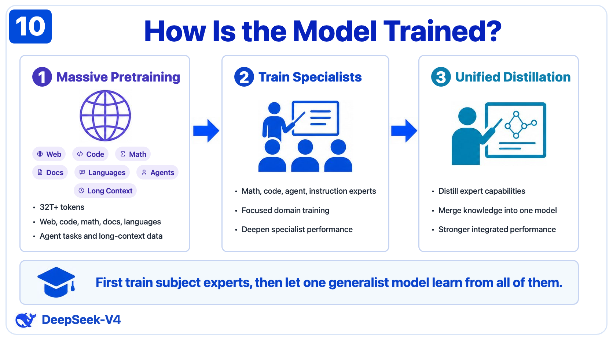
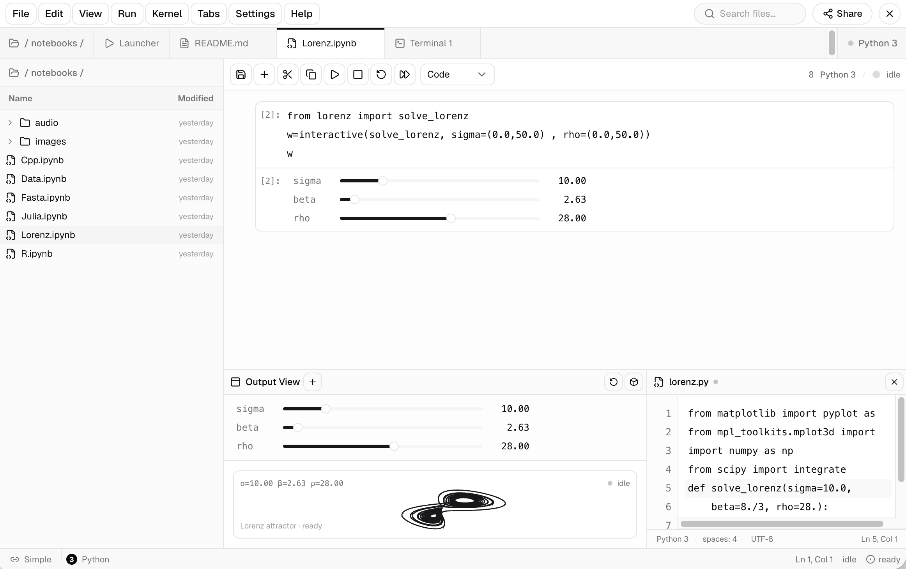
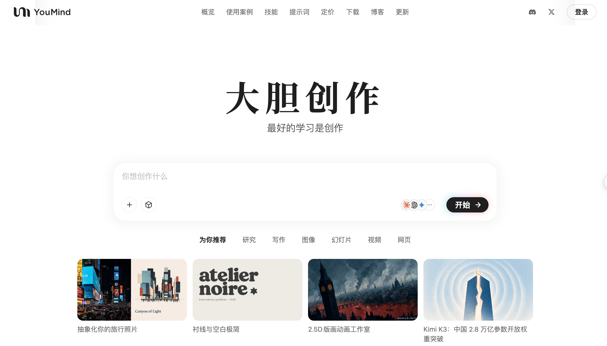
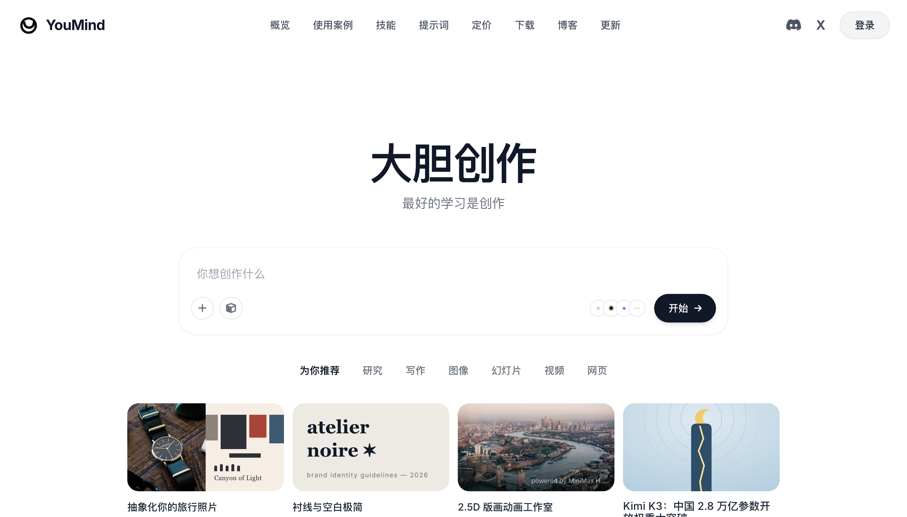
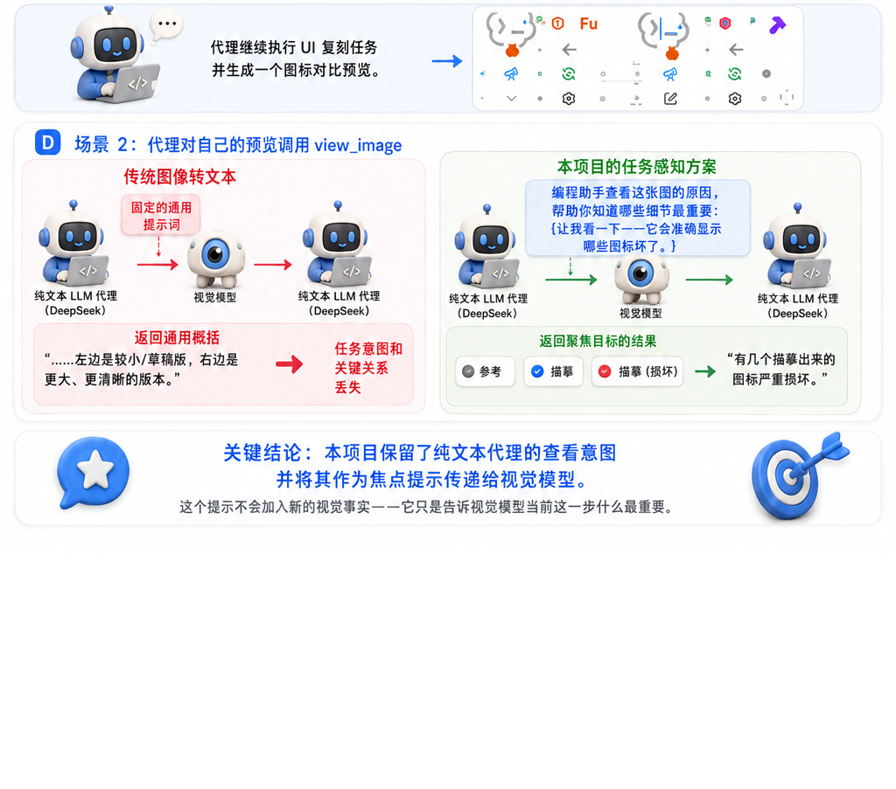

<p align="center">
  
</p>

<div align="center">

# agent-vision-toolkit

[](https://x.com/anion_ex)
[](https://github.com/Anionex/agent-vision-toolkit/stargazers)
[](https://github.com/Anionex/agent-vision-toolkit/forks)
[](https://github.com/Anionex/agent-vision-toolkit/blob/main/LICENSE)

[](https://agentskills.io)
[](https://github.com/Anionex/agent-vision-toolkit/tree/main/extensions)
[](https://github.com/Anionex/agent-vision-toolkit/tree/main/bin)

**所想即所见——给任意纯文本 coding agent 装上眼睛：图片问答、长图OCR、前端UI还原、GUI自动化，一套视觉工具箱加一个 skill，并可选无缝接入 Codex、Claude Code、Pi、Oh My Pi、OpenCode。**

🎯 agent视觉能力不一定长在模型上，也可以长在harness上。

🌐 **中文** ｜ [**English**](README.md)

</div>

如果你的 agent 已经接入 deepseek 这样的纯文本模型 ，却苦恼于模型没有多模态，不能看图、每次调用看图都会被系统拦下，本仓库提供了一套工具、技能和代理方案，让纯文本模型也能对等地甚至更好地完成各类视觉任务，尽量让纯文本模型agent的交互体验和多模态模型的交互体验保持一致，最终做到在工具加持下，文本模型agent的多模态任务能力反超不使用该仓库工具和技能的原生多模态agent。

本仓库提供两类内容：
1. **视觉工具CLIs**：多个 CLI，外加一个 skill 告诉 agent 什么时候该用哪个。任何能调用 shell 的 agent 都能使用。
2. **无缝接入**（可选升级）：透明本地代理与单文件原生插件，让**我们粘贴的图片和 agent 内置的看图工具也能完美工作**，不需要额外的工具安装，也不需要额外提示词。

所有代码均已在真实 Codex + DeepSeek 会话中验证过，同一套管线也在 Claude Code、Pi、Oh My Pi、OpenCode 中完成了真机端到端验证。

> 如果项目对你有用或为你带来了一些启发，欢迎 star🌟 & fork。

## ❤️ 赞助

> 想赞助本项目？详见 [FUNDING.md](FUNDING.md) 或发送邮件到 davidyang042@gmail.com。

<details open>
<summary>点击折叠</summary>

<table>
<tr>
<td width="220" align="center" valign="middle"><a href="https://aihubmix.com/?aff=sinZ"></a></td>
<td valign="middle">感谢 <a href="https://aihubmix.com/?aff=sinZ">AIHubMix</a> 赞助本项目！AIHubMix 是稳定、高并发的 AI 大模型 API 聚合平台，一个 API Key 即可接入 Claude、GPT、Gemini、DeepSeek 等主流模型，兼容多种协议，并提供<b>免费模型选择</b>。国内用户请通过<a href="https://inferera.com/?aff=sinZ">国内入口</a>使用，海外用户请通过<a href="https://aihubmix.com/?aff=sinZ">海外入口</a>使用。</td>
</tr>
<tr>
<td width="220" align="center" valign="middle"><a href="https://api.ewo.so/register?aff=U6PT7J"></a></td>
<td valign="middle">感谢 <a href="https://api.ewo.so/register?aff=U6PT7J">E-API</a> 赞助本项目！E-API 聚合主流 AI 模型，兼容 OpenAI、Anthropic 与 Codex 接口；部分 Claude 模型相比官方价<b>最高优惠约 98%</b>，DeepSeek V4 系列<b>优惠约 25%</b>。</td>
</tr>
</table>

</details>

## 最新动态

**2026-08-18——Skill 改名：** 内置 agent skill 由 `vision-tools` 改名为 `vision-skills`，让名称描述能力而非底层工具。

**2026-08-13——现已支持 DeepSeek Harness 原生接入。** 新增链接子包 [`dsh-vision-toolkit`](https://github.com/Anionex/dsh-vision-toolkit)，可将本工具箱作为原生 Profile Bundle 接入 DSH Web 与 Headless Profile。它提供 10 个结构化视觉工具，覆盖带意图的图片问答、目标定位、元素检测、图形描摹、裁图、像素差异对比、长截图 OCR、前景提取、主色分析和 HTML 截图，并补齐 DSH Credentials、托管隔离运行时、可预览 Artifacts、Web Settings 与 Agent 级渐进工具暴露。

该子包以 Git submodule 形式链接在本仓库中，并在 [`Anionex/dsh-vision-toolkit`](https://github.com/Anionex/dsh-vision-toolkit) 独立维护。克隆本仓库时可使用 `--recurse-submodules`，已有 checkout 可运行 `git submodule update --init --recursive`。

<details>
<summary><b>目录</b></summary>

- [最新动态](#最新动态)
- [亮点](#亮点)
- [用例技能](#用例技能)
- [实际效果](#实际效果)
- [快速开始](#快速开始)
- [工具](#工具)
- [升级：无缝接入](#升级无缝接入)
- [工作原理](#工作原理)
- [配置](#配置)
- [常见问题](#常见问题)
- [赞赏](#赞赏)
- [社区](#社区)
- [关于](#关于)

</details>


## 亮点

- **不只是看图描述，是获取llm真正关注的内容**：看图时传递用户/模型的最新意图，得到这一轮真正要用到的细节，而不是一段没有重点的宽泛描述。
- **直接粘贴图片和内置看图都支持**：直接粘贴图片，和模型调用内置工具两种方式，都能看图。
- **一套经过实战验证的视觉任务方法论**：项目提供的skill，会告诉 agent 面对不同视觉任务时应该看什么、选择哪个工具、按什么步骤推进，以及最后如何验证结果。
- **一句话安装**：直接让 agent 沿着已验证流程一键安装，视觉工具箱、skill 和无缝接入一次到位。


## 用例技能

随项目提供的 `vision-skills` skill 内置了可以直接对照执行的完整用例。
使用时机、工具调用顺序、最后如何验收，都写在对应的技能文档里：

| 用例 | Agent 会如何完成 |
|---|---|
| [识别长截图、聊天记录与滚动页面](skills/vision-skills/references/long-screenshot-ocr.md) | 避开文字寻找安全切口，按顺序逐块 OCR，保留聊天发言人、时间和引用关系，只合并确实重复的内容，并标出需要复查的边界。 [查看 Telegram 实跑示例 →](examples/long-screenshot-ocr/) |
| [根据截图或设计稿还原 UI](skills/vision-skills/references/restore-ui.md) | 优先复用项目已有组件和素材，再结合原生 UI 代码、截图素材、渲染截图与视觉对比，逐轮对齐页面或组件。 |
| [还原图标、Logo、插画等图形素材](skills/vision-skills/references/restore-graphic.md) | 从原图提取透明 PNG；需要可编辑或无损缩放时重建 SVG，并验证形状、颜色和透明边缘。 |
| [把草图、示意图或白板转成结构化代码](skills/vision-skills/references/restore-structure.md) | 识别节点、文字、连线与方向，输出可编辑的 Mermaid、Graphviz 或其他结构化表示。 |
| [根据截图操作 GUI](skills/vision-skills/references/gui.md) | 定位控件、执行一次操作、重新截图并验证结果，再继续下一步，避免在过期截图上连续操作。 |
| **更多用例** | 其他可让 agent 直接照着执行的视觉任务用例正在逐步加入。 |


## 实际效果

### 信息图还原：一句话从截图到 HTML

<p align="center">
  
  <a href="examples/infographic-restoration/how-is-the-model-trained.html">
    
  </a>
</p>

*左：原始信息图截图；右：使用 HTML/CSS 复刻的可编辑结果。[查看 HTML 源文件 →](examples/infographic-restoration/how-is-the-model-trained.html)*

### UI 还原：一句话从手绘稿到成品界面

<p align="center">
  
  
</p>

*左：作为输入的手绘参考；右：依据该手绘稿还原出的 JupyterLab 工作区界面。完整流程见 [UI 还原 playbook](skills/vision-skills/references/restore-ui.md)。由 Codex 搭配 `deepseek-v4-flash` 实际执行。*

### 快速 UI 还原：先交付近似复原

<p align="center">
  
  
</p>

*左：原始页面；右：快速复原结果。该模式优先保留主要布局、内容和视觉层级，允许颜色和前端图标库中的图标近似；目标是在约三分钟内给出第一张截图。*

<p align="center">
  
  
</p>

*左：用 `glance` 做多轮图片问答；右：用 `ground` 定位屏幕视觉元素，DeepSeek V4 自主游玩国际象棋。*

<p align="center">
  
  
</p>

*左：DeepSeek V4 回答 UI 背景风格问题并对比相近风格；右：DeepSeek V4 根据截图排查字段名称不符预期的 bug。*


## 快速开始

**最简单的安装方式，是把这句话发给 agent：**

> 根据 https://github.com/Anionex/agent-vision-toolkit 的仓库指引，在本地安装视觉工具箱和 skill。如果视觉 API 尚未配置，请按当前系统找到配置文件，并引导我填写 `VISION_API_KEY`、`VISION_BASE_URL` 和 `VISION_MODEL`。

**如果需要安装可选的无缝接入层，也可以发送：**

> 完整阅读 https://github.com/Anionex/agent-vision-toolkit/blob/main/AGENT_INSTALL.md，根据我们当前使用的 agent 应用，安装适用的视觉代理或原生 extension/plugin。如果视觉 API 尚未配置，请按当前系统找到配置文件，并引导我填写 `VISION_API_KEY`、`VISION_BASE_URL` 和 `VISION_MODEL`。

只需准备一个支持 OpenAI Chat Completions、OpenAI Responses 或 Anthropic Messages 的多模态 API，以及它的 base URL、API key 和模型名称；agent 会引导你把它们写入对应的配置文件。

> 对于可选接入层，安装完成并重启后，直接粘贴图片或让模型调用内置看图工具即可。Pi、Oh My Pi、OpenCode 走的是单文件[原生 extension](extensions/) 而不是代理，可见各 agent 的文档。

<details>
<summary><b>三步手动安装</b></summary>

**1. 指向一个视觉 API**——在 `~/.config/agent-vision-toolkit/env` 里写三个环境变量（`chmod 600`）：

```bash
VISION_API_KEY=sk-...
VISION_BASE_URL=https://openrouter.ai/api/v1
VISION_MODEL=google/gemini-3.6-flash
```

任何支持 `/chat/completions` 与 `image_url` 的 OpenAI-compatible 端点都可以（如阿里云百炼：`https://dashscope.aliyuncs.com/compatible-mode/v1` + `qwen-vl-max-latest`）。Python 客户端/代理也可设置 `VISION_API_PROTOCOL=responses` 使用 `/responses` + `input_image`，或设置 `VISION_API_PROTOCOL=anthropic` 使用 Anthropic Messages；此时 Base URL 应以 `/v1` 结尾，不要包含 `/messages`。需要英文描述时加 `LANG=en`（默认中文）。

**2. 把 CLI 放进 PATH：**

```bash
git clone https://github.com/Anionex/agent-vision-toolkit.git
export PATH="$PWD/agent-vision-toolkit/bin:$PATH"   # 写进 shell 配置以持久生效
```

`glance` 只需要 Python 3.11+；`ground`/`detect`/`crop` 和长截图 OCR 用例需要 `pillow`；`trace` 需要 `pillow` + `numpy`（只有显式使用 `--outline` 轮廓回退时才需要 `vtracer`）。只为实际使用的工具在隔离 venv 中安装可选依赖。

**3. 安装 skill**，让 agent 知道这些工具的存在以及如何组合使用：

```bash
npx skills add Anionex/agent-vision-toolkit --skill vision-skills -a codex -g --copy -y
```

也可以把 `skills/vision-skills/` 复制到你的 agent 的 skills 目录（如 `~/.codex/skills/`），重启生效。

</details>

## 工具

为 agent 设计的一组视觉工具，能够让他根据不同情况自由选择：

<details>
<summary><b><code>glance</code> —— “这张图看起来长什么样?”</b></summary>

直接对图片提问，或转写图中的文字。

```bash
glance screenshot.png -q "这张图片的主色调是什么？"
glance screenshot.png --ocr
```

```
这张图片的主色调为**白色和浅灰色，局部带淡蓝色。**
```

```
用户名
密码
登录
```

遇到滚动长截图或聊天记录时，skill 内置的工作流会寻找安全切口，调用
`glance` 逐块 OCR，合并重叠内容，并生成边界复查报告：

```bash
python3 skills/vision-skills/scripts/long_screenshot_ocr.py long-chat.png --mode chat -o long-chat.ocr.md
```

</details>

<details>
<summary><b><code>ground</code> —— “我想要的这个物体在哪？”</b></summary>

定位图片中的对象或区域，输出原图像素坐标下的边界框：

```bash
ground screenshot.png "发送按钮"
```

```
x1: 1067, y1: 841, x2: 1108, y2: 881
```

每次分析一张完整图片。加 `--region X1,Y1,X2,Y2` 可只在该框内查找，输出仍是原图坐标——小目标的放大通道。

</details>

<details>
<summary><b><code>detect</code> —— “图片里都有些什么/都在哪里？”</b></summary>

盘点图片（或指定区域）中的元素——输出编号清单，带逐字可见文字和像素框：

```bash
detect page.png
detect page.png "buttons"
detect page.png --region 238,600,953,671
```

```
1. bottom-left Do anything x1: 253, y1: 601, x2: 328, y2: 609
2. bottom-left + x1: 254, y1: 650, x2: 268, y2: 665
3. bottom-right stop button x1: 924, y1: 645, x2: 952, y2: 670
```

整屏一遍是快速初稿；密集页面要完整清单时，按区域逐块盘点。

</details>

<details>
<summary><b><code>trace</code> —— “这个的精确形状轨迹是什么？”</b></summary>

`trace` 在**本地确定性地**恢复扁平高对比图形的中心轨迹，再拟合成可编辑的 SVG 图元，如 `<circle>`、`<line>`、`<polyline>`、`<polygon>`；紧凑的实心圆点会保留成填充圆，闭合曲线也不会再被直线拟合切碎。放大镜会还原成一个圆加一条线，闪电笔画会还原成真实线段，而不是沿墨迹两侧生成杂乱 path。小图标会在内部放大分析，但输出 SVG 仍使用原图坐标。LLM 不参与这一步几何拟合；DeepSeek 之类的 agent 只负责外围的定位、裁剪、渲染和验收。只有明确需要填充物体的外轮廓时才使用 `--outline`（该回退需要 `vtracer`）。

```bash
trace icon.png -o icon.svg
trace screenshot.png --region 1563,514,1668,621 -o icon.svg
trace filled-artwork.png --outline -o silhouette.svg
```

</details>

<details>
<summary><b><code>crop</code> —— “把图片区域裁出来，重新利用”</b></summary>

`crop` 把图片中的像素盒裁成独立文件——就是 `ground`/`detect` 输出的那组
X1,Y1,X2,Y2 坐标，超出图片边界时自动收敛。同一个盒子接下来要喂给
pixel_diff、dominant_colors、trace 多次时，先裁一次存成文件复用，而不是每次
调用都在内存里重裁。需要可选依赖 `pillow`。

```bash
crop screenshot.png --region 1563,514,1668,621 -o send-button.png
```

</details>

## 升级：无缝接入

这一部分让我们在agent粘贴的截图直接可用，agent 调用内置的看图工具也不再报错。

| Agent | 接入方式 | 状态 |
|---|---|---|
| **Codex** | 透明本地代理（Responses API） | ✅ 已验证 |
| **Claude Code** | 同一个代理——把 `ANTHROPIC_BASE_URL` 指向它 | ✅ 已验证 |
| **Pi / Oh My Pi** | 单文件原生 extension（[`extensions/pi/`](extensions/pi/)） | ✅ 已验证 |
| **OpenCode** | 单文件原生 plugin（[`extensions/opencode/`](extensions/opencode/)） | ✅ 已验证 |
| 任何有 shell 的 agent | 上面的工具箱——无需接入 | ✅ |

所有入口共享配置。一次配置好后即可多处使用。

## 工作原理

### 让描述更加贴合agent的意图

大多数纯文本模型的视觉转接方案只是用多模态模型把图片变成一段通用描述，之后再丢给纯文本模型，让他自己根据描述拼凑出想要的内容，这中间隔了一层语义；一些东西必然会丢失——也就是这个地方存在的损失，让我们认为缝合方案必然带来巨大的性能损失。

为了解决这个问题，`agent-vision-toolkit` 尝试利用和得到 **agent 为什么要看这张图的动机**。它从用户消息、或模型调用 内置看图工具时自述的理由中提取出模型当时看图的动机，再把这个动机作为 **focus hint** 一并交给视觉模型。拿回来的是一段贴合任务的描述，突出当前这一步真正要紧的内容，而不是一段通用的“详细描述”。更低成本，更高的准确率，更快的响应速度。

<p align="center">
  
  
</p>

<details>
<summary><b>请求流与协议细节</b></summary>

```text
Codex -> 127.0.0.1:19100 -> 用户原有的纯文本模型上游
             |
             +-- 请求含图片时：
                 focus hint（用户的请求，或模型调用 view_image 时自述的动机）
                   -> 视觉 prompt -> 文字描述 -> 替换图片
```

</details>

## 配置

<details>
<summary><b>环境变量</b></summary>

独立 CLI 和 Python 代理使用这些环境变量，必填的只有 3 个。Pi 与 OpenCode 原生扩展使用各自设置，目前仅调用 `/chat/completions`。

| 变量 | 必需 | 说明 |
|---|---:|---|
| `VISION_API_KEY` | 是 | 多模态模型的 API key |
| `VISION_BASE_URL` | 是 | 服务商 API Base URL；可包含 `/v1`，但不要包含 `/messages` 等协议端点 |
| `VISION_MODEL` | 是 | 多模态模型名 |
| `LANG` | 否 | 视觉模型输出语言：`zh`=中文，`en`=English（默认 `zh`） |
| `VISION_API_PROTOCOL` | 否 | Python 客户端/代理的视觉 API 协议：`chat_completions`（默认）、`responses` 或 `anthropic`；Anthropic 模式使用 `x-api-key` 与 `anthropic-version` |
| `VISION_REASONING_EFFORT` | 否 | Python 客户端/代理使用 `responses` 时可选的服务商支持推理强度 |
| `VISION_ANTHROPIC_THINKING` | 否 | Anthropic thinking 模式。`omit`（默认）不发送 thinking 字段，兼容性最好；仅当所选模型明确支持时使用 `disabled` 或 `adaptive`，提供方返回 HTTP 400 时应先恢复 `omit`。当前不提供手动 `enabled` + `budget_tokens`。 |
| `VISION_USER_AGENT` | 否 | Python 客户端/代理的出站 User-Agent；默认使用浏览器兼容值，也可按服务商要求覆盖 |

</details>

<details>
<summary><b>上游出口</b></summary>

代理默认**直连**（TCP + TLS）你的模型上游，不再读取 Windows 系统代理，因此本地代理（如 Clash）宕机不会拖垮整条链路。显式代理为可选项：

- `--upstream-proxy http://127.0.0.1:7890`（或环境变量 `VISION_UPSTREAM_PROXY`）：通过该代理的 CONNECT 隧道访问上游。
- `--proxy-first`（或环境变量 `VISION_PROXY_FIRST=1`）：先试显式代理再走直连；默认顺序为先直连。

建连成功（TCP/TLS 握手完成）的路由记入内存并复用；只有连接建立阶段失败（拒绝 / DNS / TLS / 5 秒 socket 超时）才切换路由，上游返回的 HTTP 状态错误原样透传。所有路由都失败时返回 502，逐条列出路由与失败原因。HTTP 代理 URL 未写端口时使用标准端口 80；暂不支持代理鉴权。

</details>

## 前置条件

- 已接入(纯文本)模型（如 DeepSeek V4）并可正常使用的 coding agent
- 一个支持 OpenAI Chat Completions、OpenAI Responses 或 Anthropic Messages 的视觉 API；后两者分别使用 `VISION_API_PROTOCOL=responses` 与 `VISION_API_PROTOCOL=anthropic`
- 没有其他需要的配置

## 常见问题

<details>
<summary><b><code>base_url</code> 指向本地代理后，代理也需要配置上游模型的 API key 吗？</b></summary>

不需要。访问上游的网络请求虽然由 `127.0.0.1:19100` 的代理进程发出，但上游的 API key 仍由 Codex 按原有配置放在 `Authorization` 请求头中，代理会将这个请求头原样转发出去：

```text
Codex（携带原有 Authorization）
  -> 127.0.0.1:19100
  -> 纯文本模型上游（原样收到 Authorization）
```

因此不要修改 Codex 原有的认证配置，也不要在代理 env 中重复保存上游的 API key。代理 env 只需配置 `VISION_API_KEY`、`VISION_BASE_URL` 和 `VISION_MODEL`。

</details>

<details>
<summary><b>要再加入一个多模态模型，费用会增加很多吗</b></summary>
不会。主模型每次看图，调用看图工具的时候，只会将所需的意图和图片传递到多模态模型的上下文中，并配置了截断机制，因此不存在超长上下文或上下文积累的问题，成本较低。
如果想进一步压缩成本，可以使用本地部署的侧端多模态小模型来接入视觉能力。推荐的包括gemma4和qwen3.5/qwen3.6系列。

</details>

## 限制

- 这是图片转文字的一层，不会把视觉 token 直接交给纯文本模型。
- 视觉任务的整体质量由主llm+多模态llm共同决定。
- 代理的缓存只存在于进程内，重启后清空。

## 赞赏

如果本项目对你有价值，欢迎请开发者喝杯咖啡☕️


## 社区

- 安装与使用帮助：[支持说明](SUPPORT.md) 与仓库 Issue 表单
- Bug 与功能建议：[Issues](https://github.com/Anionex/agent-vision-toolkit/issues/new/choose)
- 参与贡献：[贡献指南](CONTRIBUTING.md)
- 安全问题：[安全策略](SECURITY.md)
- 社区规范：[行为准则](CODE_OF_CONDUCT.md)
- 用户可见变更：[更新日志](CHANGELOG.md)

## 关于

如果 agent-vision-toolkit 为你节省了时间，欢迎 Star、分享、参与贡献，[或赞助项目～](FUNDING.md)。

我是 [anionex](https://anionex.me/)，一名 AI 原生开发者，曾上榜 GitHub 全球开发者趋势榜第 4 名，总 Star 数超过 16k。如果你想了解我后续的更多工作，欢迎在 [X](https://x.com/anion_ex) 或 [GitHub](https://github.com/Anionex) 关注我～

## 加入交流群

欢迎加入 `agent-vision-toolkit` 项目交流群，交流使用经验、反馈问题并提出建议。请扫描下方二维码入群。

<p align="center">
  
</p>
